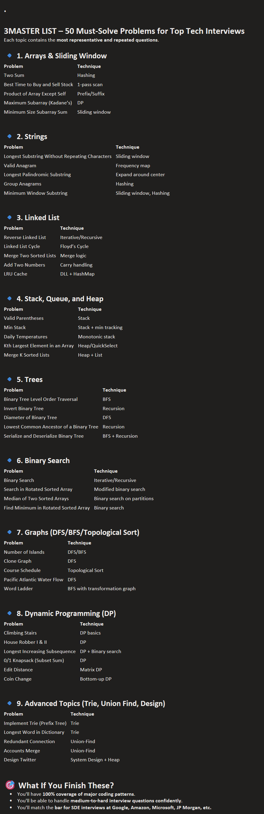
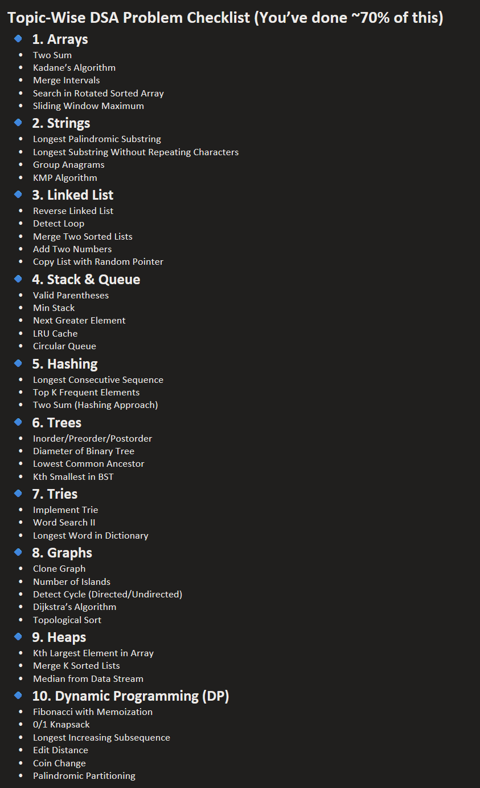

1. Arrays
	📌 Fundamental, used everywhere.
Topic	Must-Do Questions
Traversal & Manipulation	🔹 Two Sum
		🔹 Move Zeroes
		🔹 Kadane’s Algorithm (Max subarray sum)
Sorting & Searching	🔹 Merge Intervals
		🔹 Search in Rotated Sorted Array
		🔹 Dutch National Flag (Sort 0s,1s,2s)
Prefix/Suffix/Sliding Window	🔹 Subarray Sum Equals K
		🔹 Maximum Average Subarray
		🔹 Minimum Size Subarray Sum

✅ 2. Strings
	📌 Appears in all coding rounds, essential for optimization logic.
Topic	Must-Do Questions
Palindrome & Anagram	🔹 Longest Palindromic Substring
		🔹 Valid Anagram
		🔹 Longest Palindrome by Rearranging
Substring & Pattern	🔹 Longest Substring Without Repeating Characters
		🔹 Group Anagrams
		🔹 KMP Algorithm

✅ 3. Linked List
	📌 Most asked in L3 interviews.
Topic	Must-Do Questions
Basics & Pointers	🔹 Reverse Linked List
		🔹 Detect Loop (Floyd’s Cycle)
		🔹 Merge Two Sorted Lists
Advanced	🔹 Intersection of Two Linked Lists
		🔹 Copy List with Random Pointer
		🔹 Add Two Numbers

✅ 4. Stacks & Queues
	📌 Used in parsing, undo, backtracking, expression evaluation.
Topic	Must-Do Questions
Stack Basics	🔹 Valid Parentheses
		🔹 Min Stack
		🔹 Next Greater Element
Queue/Deque	🔹 Sliding Window Maximum
		🔹 LRU Cache
		🔹 Circular Queue Implementation

✅ 5. Hashing (HashMap / HashSet)
	📌 Needed for frequency/counting-based logic.
Topic	Must-Do Questions
Frequency & Count	🔹 Two Sum (again)
		🔹 Longest Consecutive Sequence
		🔹 Top K Frequent Elements
Map of Maps	🔹 Group Anagrams
		🔹 Word Pattern
		🔹 Isomorphic Strings

✅ 6. Trees
	📌 Essential for recursion, traversal, and system design.
Topic	Must-Do Questions
Traversals	🔹 Inorder, Preorder, Postorder (recursive + iterative)
		🔹 Level Order
Structure & Depth	🔹 Diameter of Binary Tree
		🔹 Lowest Common Ancestor
		🔹 Balanced Binary Tree
Binary Search Trees	🔹 Validate BST
		🔹 Kth Smallest in BST
		🔹 Convert Sorted Array to BST

✅ 7. Tries
	📌 Used in autocomplete, dictionary, pattern match.
Must-Do Questions
	🔹 Implement Trie (Insert, Search, StartsWith)
	🔹 Word Search II
	🔹 Longest Word in Dictionary

✅ 8. Graphs
	📌 DFS/BFS are critical in interviews and real world.
Topic	Must-Do Questions
DFS/BFS	🔹 Clone Graph
		🔹 Number of Islands
		🔹 Detect Cycle (Directed & Undirected)
Shortest Path	🔹 Dijkstra’s Algorithm
		🔹 Topological Sort
		🔹 Course Schedule

✅ 9. Heaps / Priority Queue
	📌 Great for greedy & scheduling problems.
Must-Do Questions
	🔹 Kth Largest Element in Array
	🔹 Merge K Sorted Lists
	🔹 Median from Data Stream

✅ 10. Dynamic Programming (DP)
	📌 King of all topics in interviews — recursion + memoization.
        Must-Do Questions
	🔹 Fibonacci with Memoization
	🔹 0/1 Knapsack
	🔹 Longest Increasing Subsequence
	🔹 Edit Distance
	🔹 House Robber I & II
	🔹 Coin Change

--------------**********************************---------------------------------------------------

---------------**********************************-----------------------------------------------------

